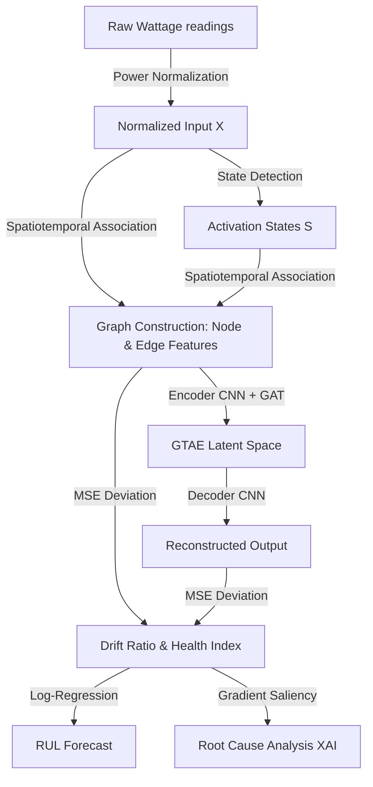
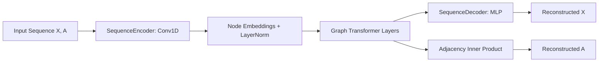

# Smart Home Predictive Maintenance: Team Onboarding Guide

Welcome to the **Graph Transformer-based Predictive Maintenance System** project! This guide is designed to take you from absolute zero to a complete understanding of the system's concept, architecture, technology stack, directory structure, and operational commands.

---

## 💡 1. The Core Concept

Modern smart home systems monitor multiple electrical appliances. However, traditional anomaly detection models treat each appliance as an isolated timeseries, ignoring key operational relationships (e.g., a washing machine run is often followed by a clothes dryer run, or a water heater activates during morning kitchen routines).

This project models a household’s appliances as a **dynamic behavioral graph**:
*   **Nodes:** Represent individual appliances, characterized by temporal power consumption and behavioral features.
*   **Edges:** Represent spatiotemporal interactions (e.g., co-activation patterns, duty cycle correlations).
*   **The Detector:** A **Graph Transformer Autoencoder (GTAE)** models the normal baseline behavior. When an appliance starts to degrade, its deviation from the baseline produces a high reconstruction error (Drift Ratio), which we use to:
    1.  Flag anomalies early.
    2.  Forecast **Remaining Useful Life (RUL)**.
    3.  Perform **Root Cause Analysis (RCA)** via Explainable AI.
    4.  Expose all metrics in a real-time interactive control dashboard.

---

## 🛠️ 2. Technology Stack

Our system is built using a clean, modern, and high-performance Python-based stack:

### Backend & Machine Learning
*   **Language:** Python 3.13 (running in a local virtual environment `.venv`).
*   **Deep Learning:** [PyTorch](https://pytorch.org/) (for custom neural network design and GPU acceleration, using native modules `torch.nn`).
*   **Data Science:** [Pandas](https://pandas.pydata.org/) and [NumPy](https://numpy.org/) (for timeseries manipulation, interpolation, rolling features, and matrix calculations).
*   **Serialized Formats:** PyTorch Tensors (`.pt`), PyTorch Weights (`.pth`), and JSON metadata.

### Frontend Dashboard
*   **Architecture:** Zero-dependency Single Page Application (SPA).
*   **Structure:** HTML5 with semantic layout.
*   **Styling:** Modern Vanilla CSS featuring **Dark Glassmorphism** (frosted glass, gradients, responsive grid).
*   **Logic:** Native JavaScript (ES6+) utilizing Chart.js for real-time analytics graphs.
*   **Backend Server:** Built-in Python `http.server` running on port `8000` (no heavy frameworks like Node or Django required).

---

## 📂 3. Repository Directory Tour

Here is a roadmap of the files and directories in the workspace:

*   **`1_raw_data/`**: Raw aggregate and appliance-level timeseries datasets (REFIT format).
*   **`3_processed_outputs/`**: Holds generated outputs, including standardized CSVs, graph tensors (`.pt`), saved model weights (`.pth`), and compiled HTML audit reports.
*   **`src/`**: The core source code containing:
    *   [graph_transformer.py](file:///c:/Users/COE-CCS-22/Desktop/New%20folder/src/core/graph_transformer.py): Custom 1D CNN Sequence encoders/decoders, GAT layers, and the Graph Transformer model.
    *   [pm_dynamic_graph.py](file:///c:/Users/COE-CCS-22/Desktop/New%20folder/src/core/pm_dynamic_graph.py): Handles multi-feature graph extraction, normalization, and graph drift tracking.
    *   [pm_pipeline.py](file:///c:/Users/COE-CCS-22/Desktop/New%20folder/src/core/pm_pipeline.py): The master script to preprocess, train, test, and export results in batch or individually.
    *   [pm_analytics.py](file:///c:/Users/COE-CCS-22/Desktop/New%20folder/src/analysis/pm_analytics.py): Contains algorithms for Health Index, fault severity, RUL estimation, and RCA.
    *   [pm_fault_injector.py](file:///c:/Users/COE-CCS-22/Desktop/New%20folder/src/analysis/pm_fault_injector.py): Degradation simulator that injects gradual wear-and-tear into the timeseries.
    *   [nilm_disaggregator.py](file:///c:/Users/COE-CCS-22/Desktop/New%20folder/src/data_processing/nilm_disaggregator.py): Non-Intrusive Load Monitoring signature-based disaggregator.
    *   [pm_report_exporter.py](file:///c:/Users/COE-CCS-22/Desktop/New%20folder/src/web/pm_report_exporter.py): Exporter to compile results into styled standalone reports.
    *   [server.py](file:///c:/Users/COE-CCS-22/Desktop/New%20folder/src/web/server.py): Houses the API endpoints and serves the control dashboard.
*   **`evaluate_model_accuracy.py`**: CLI tool to compare accuracy metrics across GTAE, GCN, and LSTM.
*   **`generate_synthetic_refit.py`**: Generates synthetic house timeseries data if raw datasets are missing.
*   **`Predictive_Maintenance_Dashboard.html`**: The main interactive interface.

---

## 📐 4. The Mathematical Pipeline

To understand how data flows through our algorithms, follow these stages:



### Key Mathematical Formulae

1.  **Normalization:** Normalizes power values to a scale of $[0, 1]$ to compare low-power and high-power appliances:
    $$X_{n, t}^{(0)} = \frac{P_{n, t}}{\max_{t} (P_n) + \epsilon}$$
2.  **Appliance State:** Binary state detection based on an activation threshold $\theta_n$:
    $$S_{n, t} = \begin{cases} 1 & \text{if } P_{n, t} \ge \theta_n \\ 0 & \text{otherwise} \end{cases}$$
3.  **Spatiotemporal Edge Weights (Jaccard Co-activation):**
    $$A_{i,j}^{(1)} = \frac{\sum_{t \in w} (S_{i,t} \cdot S_{j,t})}{\sum_{t} S_{i,t} + \sum_{t} S_{j,t} - \sum_{t} (S_{i,t} \cdot S_{j,t})}$$
4.  **Health Index ($H$):**
    $$H_n(w) = 100 \cdot e^{-0.1 \cdot \max\left(0, \text{Drift Ratio}_n(w) - 1.0\right)}$$
5.  **RUL Projection (Exponential Decay Model):**
    $$H(t) = H_0 \cdot e^{-\lambda t} \implies \text{RUL (Days)} = \frac{\ln(50) - \ln(H_0)}{-\lambda}$$
6.  **XAI Feature Saliency:**
    $$\text{Saliency}_{n,w,f} = \left| \frac{\partial \mathcal{L}_{recon, n}}{\partial X_{n,w,f}} \right|$$

---

## 🤖 5. The GTAE Model Architecture

The core of our predictive maintenance framework is the **Graph Transformer Autoencoder (GTAE)**. It consists of three primary components:



### A. Sequence Encoder (`SequenceEncoder`)
*   **Purpose:** Encodes an appliance's temporal power and state sequence of length $W = 256$ into a continuous node embedding vector of size $D = 64$.
*   **How it works:**
    1.  It applies three 1D convolutional layers (`nn.Conv1d`) to capture local temporal relationships and variations in power curves.
    2.  Max pooling layers (`nn.MaxPool1d`) downsample the length by half at each step.
    3.  A final Linear projection (`nn.Linear`) maps the flattened feature map to the embedding dimension ($D = 64$).
*   This yields an initial representation of *what* each appliance is doing individually in the current window.

### B. Node Identity Embeddings (`nn.Embedding`)
*   **Purpose:** Adds spatial identity to each node.
*   **Why it's needed:** If multiple appliances are in an `OFF` state (e.g., both consuming 0 Watts), their raw timeseries are identical. Adding a learnable embedding unique to each appliance index ($0$ to $N-1$) allows the network to distinguish nodes even when inactive.

### C. Graph Transformer Layer (`GraphTransformerLayer`)
*   **Purpose:** Allows appliances to share information along valid behavioral relationships (edges).
*   **Mechanism:**
    1.  Computes standard **Multi-Head Self-Attention** queries ($Q$), keys ($K$), and values ($V$) to model global relationships.
    2.  **Adjacency Gating:** Attention coefficients are element-wise scaled (Hadamard product) by the Jaccard co-occurrence adjacency matrix:
        $$\text{Gated Attention} = \text{Attention}(Q, K) \odot \mathbf{A}$$
        This ensures that message passing is physically routed and weighted by co-occurrence probability, preventing arbitrary information leaks.
    3.  Applies residual connections, Feed-Forward layers, and Layer Normalization.

### D. Decoders
1.  **Sequence Decoder (`SequenceDecoder`):** Uses an MLP to project the processed node embeddings back to the original timeseries sequence dimension $[W, \text{Channels}]$.
2.  **Adjacency Decoder:** Reconstructs the structural links using a scaled dot product inner-product decoder:
    $$\hat{A} = \text{sigmoid}\left(\frac{\mathbf{H}\mathbf{H}^T}{\sqrt{d_k}}\right)$$

### E. Loss Optimization
The model is optimized end-to-end to reconstruct both features and graph structures simultaneously:
$$\mathcal{L}_{\text{total}} = \mathcal{L}_{\text{Feature MSE}} + 0.2 \cdot \mathcal{L}_{\text{Adjacency BCE}}$$

---

## 📊 6. Comparison Models & Baselines

To evaluate the benefits of our Graph Transformer approach, the codebase includes implementation and evaluation support for **six different architectures** in [graph_transformer.py](file:///c:/Users/COE-CCS-22/Desktop/New%20folder/src/core/graph_transformer.py). Below is a deep architectural comparison of how they differ in mathematical formulation, information routing, and anomaly sensitivity.

| Model Name | Type | Message Passing Equation | Adjacency Handling / Edge Masking | Strengths & Failure Modes |
| :--- | :--- | :--- | :--- | :--- |
| **GTAE** | Graph Transformer Autoencoder | $$\text{Attn} = \text{softmax}\left(\frac{QK^T}{\sqrt{d_k}}\right) \odot \mathbf{A}$$ | **Continuous Gated Attention:** The attention scores are gated element-wise by the Jaccard similarity edge weights $\mathbf{A} \in [0, 1]$. | **Strongest.** Learns dynamic query-key alignments but forces representation updates to route along active co-activation paths. Captures subtle multi-device schedule drift. |
| **GAT** | Graph Attention Autoencoder | $$\alpha_{i,j} = \text{softmax}_j\left(\text{LReLU}(\mathbf{a}^T [\mathbf{W}h_i \| \mathbf{W}h_j])\right)$$ | **Hard Masking:** Attention scores are computed only for connected nodes. Non-connected nodes ($A_{i,j} == 0$) are masked out using $-\infty$ in softmax. | **Anisotropic.** Learns dynamic weights per edge, but is restricted strictly to immediate neighbors. If two appliances lack a direct co-activation edge, they cannot pass messages directly. |
| **GCN** | Graph Convolutional Autoencoder | $$H^{(l+1)} = \text{ReLU}\left(\tilde{D}^{-1} \mathbf{A} H^{(l)} \mathbf{W}\right)$$ | **Static Normalization:** Adjacency weights are normalized by node degree (number of connections): $\tilde{D}_{i,i} = \sum_j A_{i,j}$. | **Isotropic.** Every neighboring node is aggregated with a static weight dictated purely by the graph structure. Fails to model temporal/directional activation dynamics. |
| **LSTM** | Long Short-Term Memory Autoencoder | $$h_i = \text{Encoder}(X_i)$$ | **Ignored.** Adjacency matrix is completely bypassed in the latent space. | **Temporal Baseline.** Models single-appliance behavior well. Fails completely if an anomaly consists of a schedule shift relative to other appliances (e.g., wash cycle running at the wrong time). |
| **GRU** | Gated Recurrent Unit Autoencoder | $$h_i = \text{Encoder}(X_i)$$ | **Ignored.** Adjacency matrix is completely bypassed. | **Temporal Baseline.** Faster version of LSTM, but carries the same limitation of ignoring all inter-appliance correlations. |
| **CNN** | Convolutional Autoencoder | $$h_i = \text{Encoder}(X_i)$$ | **Ignored.** Adjacency matrix is completely bypassed. | **Temporal Baseline.** Extremely fast training, but completely blind to recurrent structures and multi-device dependencies. |

---

### Detailed Architectural Differences

#### 1. Information Routing (GAT vs. GCN vs. GTAE)
*   **GCN (Static Propagation):** In a GCN layer, the embedding of the Kettle node is averaged with the Fridge and Microwave embeddings based purely on their static degree counts. The model cannot learn that the correlation between the Kettle and Microwave is more important during breakfast hours than during the night.
*   **GAT (Anisotropic Neighbor Attention):** GAT improves on GCN by using a learnable attention parameter vector $\mathbf{a}$ to dynamically weight edges. However, it uses a hard mask: if two nodes are not connected, the attention probability is forced to $0$.
*   **GTAE (Gated Global Attention):** GTAE uses Transformer self-attention to compute queries and keys across all appliances. It then multiplies these scores element-wise by the continuous co-activation matrix $\mathbf{A}$. This allows the model to scale edge connections smoothly:
    *   If $\mathbf{A}_{i,j} = 0.8$ (strong connection), the model easily attends to node $j$.
    *   If $\mathbf{A}_{i,j} = 0.0$ (no connection), the attention probability is zeroed out.
    *   If $\mathbf{A}_{i,j} = 0.2$ (weak relationship), information is partially gated, representing soft structural biases.

#### 2. Graph-Aware vs. Graph-Blind Anomaly Detection
*   **Graph-Blind Models (LSTM/GRU/CNN):** If a Washing Machine consumes its normal $500\text{W}$ but is operated in the middle of the night (breaking its typical co-occurrence with the Tumble Dryer), a temporal-only model reconstructs the sequence perfectly because a $500\text{W}$ profile is normal. Its reconstruction error remains low, failing to flag the behavioral shift.
*   **Graph-Aware Models (GTAE):** Because GTAE encodes both the sequence $X$ and the adjacency matrix $A$, running the Washing Machine in isolation changes the graph's edge weights. The mismatch between the normal co-occurrence baseline and the current anomalous isolated run generates high reconstruction errors in the adjacency decoder, triggering a **Graph Drift Alert**.

---

## 🚀 7. Getting Started (Step-by-Step Commands)

Ensure you run all commands from the root directory using the `.venv` virtual environment interpreter:

### Step 1: Set Up your Environment
Check if `.venv` is active, or activate it in your terminal:
```powershell
# Windows PowerShell
.venv\Scripts\Activate.ps1
```

### Step 2: Generate Sandbox Test Data
If you don't have raw REFIT datasets inside `1_raw_data/`, run the synthetic generator script to create realistic smart home timeseries for testing:
```bash
.venv\Scripts\python generate_synthetic_refit.py
```

### Step 3: Run the Predictive Maintenance Pipeline
Execute the pipeline on a household (e.g., House 2) to build graphs, train the GTAE model, simulate wear-and-tear faults, and output the analysis reports:
```bash
.venv\Scripts\python src/core/pm_pipeline.py --house 2 --epochs 15
```
*To batch process all households, run with `--house all`.*

### Step 4: Launch the Dashboard
Start the local server hosting the glassmorphism control panel:
```bash
.venv\Scripts\python src/web/server.py
```
Open your browser and navigate to: **[http://localhost:8000](http://localhost:8000)**

### Step 5: Run Accuracy Evaluation (Optional)
Compare the GTAE model performance against baselines (LSTM and GCN):
```bash
.venv\Scripts\python evaluate_model_accuracy.py --house 2 --threshold 1.15
```

---

## 💡 Tips for Development
*   **Adjusting Configs:** You can adjust anomaly thresholds, RUL boundaries, and degradation simulator values directly in [pm_config.json](file:///c:/Users/COE-CCS-22/Desktop/New%20folder/pm_config.json).
*   **Analyzing Outputs:** Look inside [3_processed_outputs/](file:///c:/Users/COE-CCS-22/Desktop/New%20folder/3_processed_outputs) to find the exported JSON logs and fully interactive HTML reports for offline auditing.
